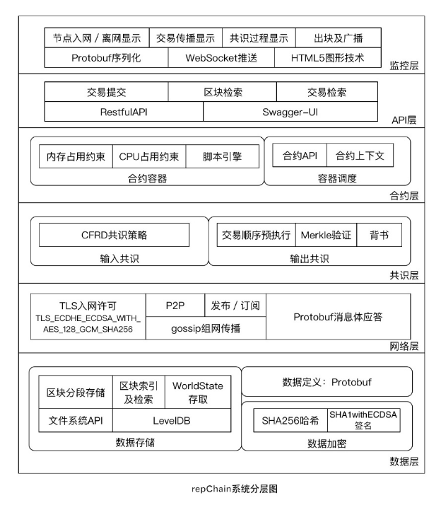

repChain简介
====================

3.1 简介
-------------

3.1.1 项目背景
++++++++++++++++++

	随着区块链技术的飞速发展，各种基于区块链的平台应运而生，包括以比特币、以太坊为代表的公有链和以fabric为代表的联盟链，
	而以身份身份准入的形式参与区块链组网有更大的应用场景，称之为许可链。

	许可链不同于公开链与传统的中心化应用，它在身份准入的基础上建立安全信道，利用区块链的去中心化特征，
	解决多个对等主体之间信任问题，达到降低共识成本、提高交易实时性和交易通量的目的。大多开源区块链代码体量大、模块耦合度高，
	在行业应用场景中存在不足，repChain正是在此背景下诞生的一款区块链核心组件。

3.1.2项目目标
++++++++++++++++

	repChain的开发目标是使区块链与企业级行业应用更好融合，repChain的标准化、模块化、可视化三大特性使其可以适用于多种不同的应用场景。

	在保险行业领域，repChain适用于签约环节中的体检结果入链和理赔环节的证据入链共享环节，
	利用区块链的不可篡改特性和许可链中的可信节点共享特性，防范保险行业中的理赔欺诈风险，并实现理赔的便捷与成本的节省。

	在数字资产领域，repChain适用于数字资产分配、持有证明和资产转移等方面。资产数字化的趋势正在发生，
	除积分、信贷等金融资产外，还包括图片、书籍等实物资产，完成数字资产和数字身份的对应后，
	数字资产就可以完成赠送、转让、租赁等资产转移，这正是区块链中的智能合约发挥作用之处。

	在物联网领域，repChain适用于嵌入式系统签名和食品溯源。在嵌入式系统签名方面，通过技术保证签名的不可篡改性，降低违约以及法律纠纷的风险；在食品溯源方面，repChain能保障平台数据的不可篡改并对信息进行加密保护，保护消费者的利益。

	除此之外，在税务、工商、土地等政务服务方面，repChain也能相应发挥作用，更加高效的适应这些应用场景。

3.2 区块链是什么
------------------------

	狭义来讲，区块链是一种按照时间顺序将数据区块以顺序相连的方式组合成的一种链式数据结构，
	并以密码学方式保证的不可篡改和不可伪造的分布式账本。

	广义来讲，区块链技术是利用块链式数据结构来验证与存储数据、利用分布式节点共识算法来生成和更新数据、
	利用密码学的方式保证数据传输和访问的安全、利用由自动化脚本代码组成的智能合约来编程和操作数据的一种全新的分布式基础架构与计算范式 。

	区块链技术相关的数据对象结构包括区块、事务、实体、合约、账户、配置六个主要数据对象。
	其中区块链核心的数据对象包括事务、实体和合约。每一区块数据对象中包含一个或多个事务数据对象，
	每个事务对象包括属性类的实体数据对象，还包括事务的业务逻辑，即合约数据对象。在区块链核心数据对象之外，
	包括配置数据对象，提供区块链系统正常运行过程中所需的配置信息。配置数据对象和区块链核心数据对象共同构建了区块链运行所需的基础数据基础。
	而账户数据对象表示区块链业务的实际发起者和相关方对应的数据结构。

3.3分布式账本
--------------------

	如果我们把数据库假设成一本账本，读写数据库就可以看做一种记账的行为，区块链技术的原理就是在一段时间内找出记账最快最好的人，
	由这个人来记账，然后将账本的这一页信息发给整个系统里的其他所有人。这也就相当于改变数据库所有的记录，
	发给全网的其他每个节点，所以区块链技术也称为分布式账本（distributed ledger）。

3.4 repChain是什么
---------------------

	repChain是面向工程实践、易于集成的区块链核心组件，全称为Responsive Permission Chain，顾名思义，
	是采用响应式编程实现自主可控的许可链，具有标准化、模块化、可视化三个特征。

	1. **标准化：** 尽可能采用经过工程实践认证的标准组件，在基本功能稳定，满足工程实施的基础上大幅减少代码量，方便他人改造使用。
	2. **模块化：** 节点间以消息格式交互，节点内部以状态驱动，具备模块替换的可行性。
	3. **可视化：** 将复杂的交易传播、共识入块的过程直观化。

	repChain系统共分为六层，从底层到上层分别是数据层、网络层、共识层、合约层、API层、监控层。

	* **数据层：** 负责数据格式定义，并以此为基础实现数据的交换、验证、存储、读取及检索。
	* **网络层：** 采用JDK内置的TLS实现，支持入网许可验证，在此基础上进行去中心化的gossip组网，网络传播支持P2P和Pub/Sub两种方式。
	* **共识层：** 负责共识模块完成区块的输入共识和输出共识。输入共识采用兼顾实时性和安全性的CFRD算法，既照顾到交易的实时性要求，又能在一定程度防止入网节点串通作弊；输出共识为抽签出的出块人在本地预执行交易，将预出块发送给背书节点，搜集到足够多背书节点的签名后正式出块。
	* **合约层：** 为共识层提供交易执行环境，具备安全隔离、解释和执行脚本、为脚本执行提供上下文环境和底层API访问的功能。
	* **API层：** 提供外部接口，允许第三方应用以Restful的形式与系统交互，并集成了Swagger-UI，允许开发者进行在线测试。API层提供交易提交、交易检索、区块检索、链检索等基本功能。
	* **监控层：** 在区块链网络中收集事件和日志，并将其以Protobuf的格式序列化到Web端，以H5图形技术进行可视化实时状态展示和日志回放。

	下图是repChain的系统分层图，它的六层架构展示了每层之间的逻辑关系，从图中也可以看到每一层包含的具体技术细节，
	方便开发者从总体上理解repChain的结构框架和层次。

