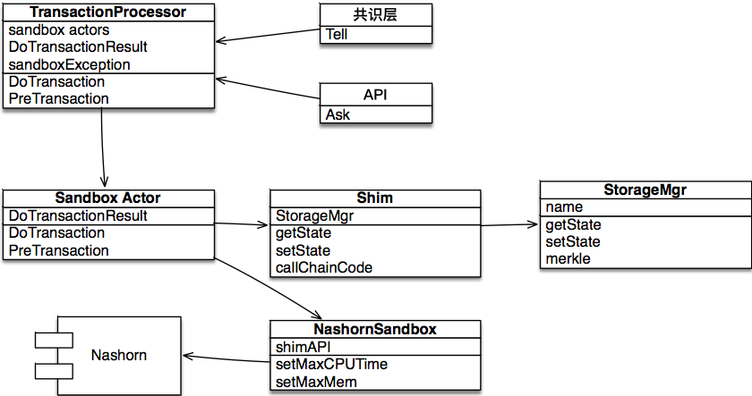
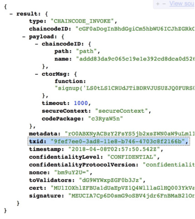

智能合约
=============

8.1 了解智能合约
-----------------------------

智能合约可以看做是一个跨学科的复合名词，合约取自法律上的合同概念，智能指的是能自动执行的计算机程序，
合在一起的智能合约就是能像计算机程序一样自动执行的法律合同。

要实现智能合约，首先需要使用计算机语言编写合同中的条款，然后将编写的程序部署到区块链上去执行。
从计算机用户的角度来看，智能合约可以限定为更好理解的智能合约代码。

智能合约最早的形式是比特币中的扩展脚本，由于比特币设计之初并没有考虑智能合约，因此这种扩展脚本受到诸多限制，
后来Ethereum平台设计了合约编程语言solidity，提供了执行合约的虚拟机，进一步提升了智能合约的表述能力。
由于区块链智能合约在商业上应用面临法律效力问题，因此现有智能合约一般会在代码中存储一份相应的法律合同文本文件，
以应对法律风险。到今天，除了法律合同，智能合约已经应用到了更多的场景中，比如数字化交易所、供应链、物流等。

节点可以接受经安全策略检验的智能合约，支持对合约预验证（以支持输出共识）和正式执行。
由于合约脚本是由用户提交非信任脚本（untrusted script），因此必须将其隔离在一个安全沙箱内。

合约脚本基于系统提供的对系统全局状态（state）进行操作（set、get）的API，此外合约脚本也可以调用其他合约。
对js引擎进行封装，建立一个sandbox，在合约容器中进行预执行。

8.2 编写智能合约
---------------------

8.2.1 语言选择
+++++++++++++++++++

目前repChain支持js和scala两种语言，根据判断可以进行选择执行哪种合约。

8.2.2 合约样例
+++++++++++++++++

**JS版智能合约**
	
.. code-block:: javascript
   :linenos:
   
	function loadCert(cert){
		shim.loadCert(cert);
		print("cert:"+cert);
	}
	function write(pn,pv){
		shim.setVal(pn,pv);
	}
	function set(pm){
		for(x in pm){
			write(x,pm[x]);
		}
	}
	function read(pn){
		return shim.getVal(pn);
	}
	function transfer(afrom,ato,amount){
			if(afrom != tx_account)
			throw "["+tx_account+"]无权从["+afrom+"]转出资产"
		var rfrom = read(afrom);
			if(rfrom<amount)
			throw "余额不足!"
		var rto = read(ato);
		write(afrom,rfrom-amount);
		write(ato,rto+amount);
		}
	function put_proof(pn,pv){	
		//先检查该hash是否已经存在,如果已存在,抛异常
		var pv0 = read(pn);
		if(pv0)
			throw '['+pn+']已存在，当前值['+pv0+']';
		shim.setVal(pn,pv);
		print('putProof:'+pn+':'+pv);
	}
	function signup(cert,inf){
		shim.check(tx_account,tx)
		return shim.signup(cert,inf);
	}
	function destroyCert(certAddr){
		shim.check(tx_account,tx)
		shim.destroyCert(certAddr);
	}
	function replaceCert(pemCert,certAddr){
		shim.check(tx_account,tx)
		return shim.replaceCert(pemCert,certAddr);
	}
	
**Scala版智能合约**
	
.. code-block:: java
   :linenos:
   
	import org.json4s._
	import org.json4s.jackson.JsonMethods._
	import rep.sc.contract._
	import rep.storage.FakeStorage.Key
	/**
	 * 资产管理合约
	 */
	class NewContract extends IContract{
	  case class Transfer(from:String, to:String, amount:Int)
	  case class ReplaceCert(cert:String, addr:String)
	  implicit val formats = DefaultFormats 
		def init(ctx: ContractContext){      
		  println(s"tid: $ctx.t.txid")
		}   
		def set(ctx: ContractContext, data:Map[String,Int]):Object={
		  println(s"set data:$data")
		  for((k,v)<-data){
			ctx.api.setVal(k, v)
		  }
		  null
		}       
		def read(ctx: ContractContext, key: String):Any={
		  ctx.api.getVal(key)
		}  
		def loadCert(ctx: ContractContext, cert: String): Unit = {
			ctx.api.loadCert(cert);
			  print("cert:"+cert);
		}   
		def write(ctx: ContractContext, data:Map[String,Int]):Object = {
		   for((k,v)<-data){
			ctx.api.setVal(k, v)
		  }
		  null
		}   
		def put_proof(ctx: ContractContext, data:Map[String,Any]):Object={
		  //先检查该hash是否已经存在,如果已存在,抛异常
		  for((k,v)<-data){
			  var pv0 = ctx.api.getVal(k)
			  if(pv0 != null)
				  throw new Exception("["+k+"]已存在，当前值["+pv0+"]");
			  ctx.api.setVal(k,v);
			  print("putProof:"+k+":"+v);
		  }
			"put_proof ok"
		}
	}
   
8.3. 合约部署
------------------

8.3.1 构成
+++++++++++++++++

   
系统构成见上图，箭头指向从上层往底层。从底层往上层解释其运作机制：

* Nashorn：即jdk内置的javascript脚本引擎，支持构造脚本执行的上下文，支持动态解释执行。
* NashornSandbox：负责对Nashorn进行隔离封装，监视脚本的cpu占用时长、内存占用情况，必要时可以终止脚本执行。
* Shim：负责提供脚本上下文的底层API，包括操作worldState的get、set，以及对其他合约的调用。其中对worldState的操作，依赖StorageMgr完成。
* Sandbox Actor：每个chainCode对应一个Sandbox Actor实例，该actor接收传入的交易，针对交易的合约部分进行执行或预执行，传回执行结果DoTransactionResult，执行结果包含6项。
* TransactionProcessor：负责向上提供交易执行／预执行服务，向下管理着多个Sandbox Actor，确保每个合约对应唯一的Sandbox Actor。
* TransactionProcessor的调用方包括API层和共识层，API层以Ask（Send and Receive模式）的方式调用，同步等待并返回结果给web；共识层以Tell（Fire and Forget模式）调用，根据返回结果自行调度。

8.3.2 合约调用
++++++++++++++++++++

例1：注册合约调用

.. code-block:: javascript
   :linenos:
   
   signup('证书的base64字符串','{a:"v1",b:"v2"}');

例2：存证合约调用

.. code-block:: javascript
   :linenos:
   
	put_proof('1MH9xedPTkWThJUgT8ZYehiGCM7bEZTVGN44','json content');
	read('1MH9xedPTkWThJUgT8ZYehiGCM7bEZTVGN44');

8.3.3 合约验证
++++++++++++++++++++

智能合约功能的实现，依赖于满足一定业务需求，能自动执行和验证的各类脚本和算法。区块链用户可通过一个用户接口，
与已制定部署的智能合约交互，达成交易且无需人为干预而产生。智能合约测试目的是验证合约脚本和算法的正确性、适合性。

测试内容：区块链底层架构应支持一种或多种智能合约，实现自我执行和自我验证，无需人为干预。

	对于注册合约的验证结果如下：
	

	
	   
	   
