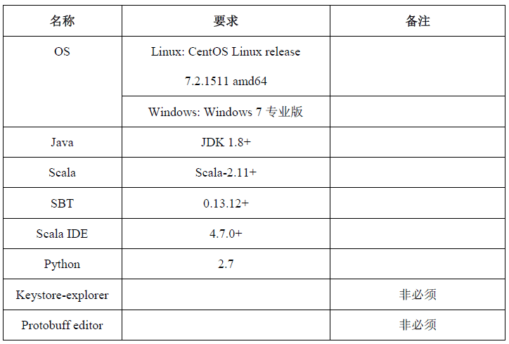
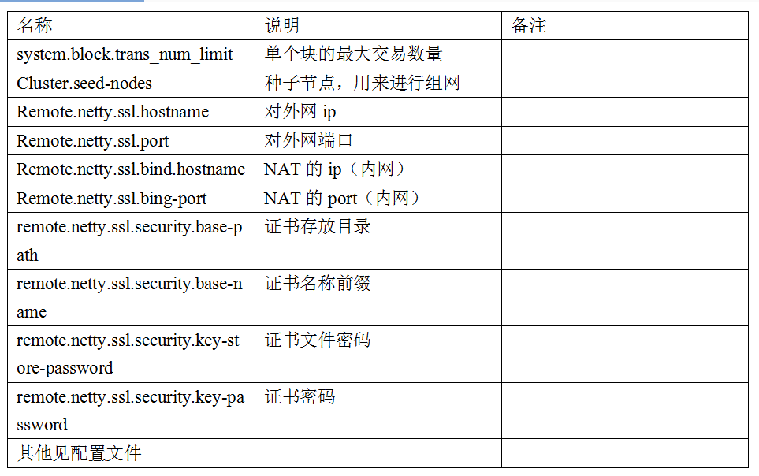
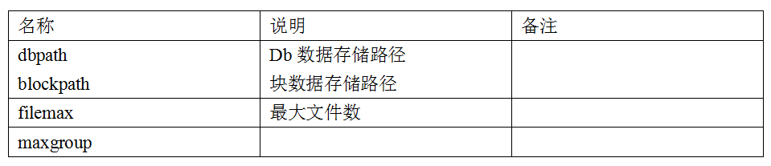
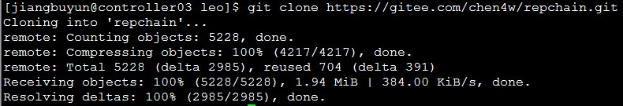
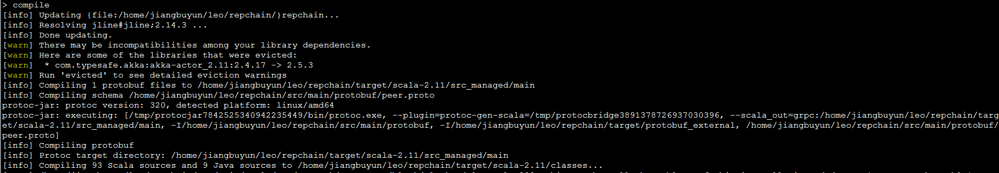
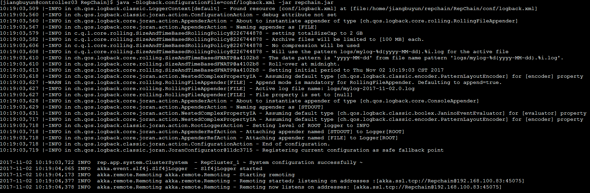

repChain操作指南
===========================

10.1 安装
-------------

* git clone https://gitee.com/chen4w/repchain
* install jdk8+
* install Scala
* install SBT
* install scala IDE
* install keystore-explorer ——用于生成密钥对的工具,非必须
* install protobuf editor——编辑protobuf定义工具，非必须

10.2 配置
----------
10.2.1 硬件配置
++++++++++++++++++

上面描述的硬件配置为最低配置，在满足最低配置的要求下，尽量提高配置。

10.2.2 软件配置
+++++++++++++++++

10.3. 系统配置和相关文件
------------------------
10.3.1 程序目录结构
++++++++++++++++++++++

.. image:: ./images/chapter10/mulujiegou.png
   :height: 1907
   :width: 1394
   :scale: 50
   :alt: 程序目录结构
   
10.3.2 系统配置说明
++++++++++++++++++++++

   
10.3.3 存储配置说明
+++++++++++++++++++++

10.3.4 日志配置说明
+++++++++++++++++++++++

针对logback日志框架的配置文件。详情见官网：https://logback.qos.ch/manual/configuration.html

10.4 系统部署
------------------

10.4.1 Linux
++++++++++++++++

1)git clone https://gitee.com/chen4w/repchain.git

   
2)进入repchain目录（cd repchain），并执行sbt（sbt）

.. image:: ./images/chapter10/enterrepchain.png
   :height: 216
   :width: 1465
   :scale: 50
   :alt: 进入repchain目录

3)执行compile，根据build.sbt下载依赖包并编译（compile）

   
.. image:: ./images/chapter10/compiledone.png
   :height: 46
   :width: 1465
   :scale: 50
   :alt: 编译repchainc成功

4)修改build.sbt中mainClass in (Compile, packageBin) := Some("rep.app.Repchain")的类名，并执行assembly命令打包（assembly）

.. image:: ./images/chapter10/assembly.png
   :height: 1217
   :width: 1465
   :scale: 50
   :alt: 打包repchain

.. image:: ./images/chapter10/assembly2.png
   :height: 926
   :width: 1465
   :scale: 50
   :alt: 打包repchain
   
从截图中可以看到打包命令执行成功，jar包输出在repchain/target/scala-2.11/repchain.jar

5)把jar包，相关的配置文件放到同一个目录下

.. image:: ./images/chapter10/packrepchain.png
   :height: 93
   :width: 1465
   :scale: 50
   :alt: 集成配置文件

6)当前目录下执行命令:java -Dlogback.configurationFile=conf/logback.xml -jar repchain.jar

   
7)浏览器输入http://localhost:8081/web/g1.html

.. image:: ./images/chapter10/repchain_view.png
   :height: 716
   :width: 1465
   :scale: 50
   :alt: repchain可视化界面

8)浏览器输入http://localhost:8081/swagger/index.html

.. image:: ./images/chapter10/swaggerui.png
   :height: 843
   :width: 1465
   :scale: 50
   :alt: swaggerui

10.4.2 Windows
+++++++++++++++++++++

1. git clone download the project to local。下载源码到本地
2. under the project root path,sbt to download dependencies.(maven默认仓库下载龟速,应使用阿里镜像)。下载依赖包，解决依赖关系
3. compile to generate protobuf scala class. 执行compile命令编译
4. eclipse to generate eclipse project settings.
5. open scala IDE, File->Import->Existing Projects into Workspace。导入编辑器
6. right click rep.app.Repchain.scala,Run As->Scala Application(单机组网5个节点)
7. Run configuration 配置VM参数 -Dlogback.configurationFile=conf/logback.xml (使logback配置生效)
8. view realtime graph http://localhost:8081/web/g1.html
9. view rest apis http://localhost:8081/swagger/index.html

10.5.系统测试
-----------------

* 单机多节点测试
* 多机多节点测试

10.6.系统运行
---------------

本系统可以分为2种方式部署：

1. 单机多节点部署：在一台机器启动一个实例，该实例中包含多个区块链对等节点。
2. 多机多节点部署：在一台或者多台机器上启动多个实例，每个实例就是一个区块链对等节点。

系统在运行时，IDE环境中需要配置VM参数 -Dlogback.configurationFile=conf/logback.xml (使logback配置生效)。运行jar包时需要指定参数java -Dlogback.configurationFile= conf/logback.xml-jar repchain.jar

10.6.1单机多节点部署
++++++++++++++++++++++

	单机多节点部署运行的Main类是:rep.aap.Repchain.scala 可以在文件里面设置运行节点的个数默认（4/5）

	Conf/Store.properties设置存储路径，一般默认
	
	Conf/system.conf 设置系统运行的参数主要的有下面几项：
	
		* System.ws_enable 设置是否开启浏览器、API接口
		* System.trans_create_type 设置是否开启自动交易
	
	其余的默认即可，如有需要自行修改。
	
	最后可以在IDE中运行RepChain或者运行已经打好的jar包。

10.6.2 多机多节点部署
++++++++++++++++++++++++

多机多节点部署运行的Main类是:rep.aap.Repchain_Single.scala

	Conf/Store.properties设置存储路径，一般默认
	
	Conf/system.conf 设置系统运行的参数主要的有下面几项：
	
	* System.ws_enable 设置是否开启浏览器、API接口
	* System.trans_create_type 设置是否开启自动交易
	* Akka.cluster.seed-nodes 种子节点列表，列表中的第一个会默认为leader,节点启动后会依照顺序发出加入请求，所以在这里一定要注意确保leader节点启动之后再启动其他节点，不然集群一直处于不收敛状态。在这里最好设置一个稳定的种子节点作为leader，
	* Akka.remote.netty.ssl 设置节点的ip地址和端口，如果使用了NAT地址映射需要指定内部地址和外部地址。

	.. image:: ./images/chapter10/multiconf.png
	   :height: 537
	   :width: 1220
	   :scale: 50
	   :alt: 多机组网配置

	其余的默认即可，如有需要自行修改。最后可以在IDE中运行RepChain或者运行已经打好的jar包。

	另：单机节点在运行时需要在后面加参数来区分节点，如java -Dlogback.configurationFile=conf/logback.xml -jar repchain.jar 1。1用来唯一标志该节点
	再次强调节点必须一个一个运行，一个启动后再启动另一个，leader节点最先启动。
