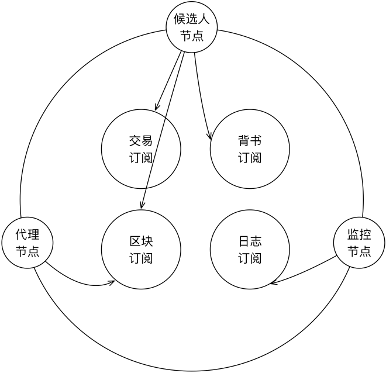

快速入门
=================

4.1 前期准备
----------------
4.1.1 相关工具及术语
++++++++++++++++
	* JDK1.8+
	* Python2.7及以上版本
	* 安装Scala环境
	* 安装sbt工具
	* 安装scala IDE
	* 安装keystore-explorer ——用于生成密钥对的工具,非必须
	* 安装protobuf editor——编辑protobuf定义工具，非必须

	**组网:** 去中心化分布式网络

	**准入:** ECDSA256 身份验证+TLS安全信道

	**通信:** 支持P2P方式和Pub/Sub方式

	**输入共识:** 免协商随机抽签+顺位出块、SHA256散列、SHA1withECDSA签名

	**输出共识:** worldState的merkle结果背书

	**智能合约:** 支持javaScript和scala的Sandbox

	**存储:** key-value存储+文件索引

	**API:** 提供restfulAPI，支持Swagger-UI

	**监控:** 图形化实时状态和日志回放

4.2 查看交易
------------------

	交易是指导致账本状态改变的一个操作，不限于转账交易，交易定义的基础是对智能合约的定义。

4.2.1 交易密级
++++++++++++++++

	枚举型选项，描述交易是否公开

	.. code-block:: java
	   :linenos:
	   
	   enum ConfidentialityLevel {
			PUBLIC = 0;
			CONFIDENTIAL = 1;
		}

4.2.2 交易
++++++++++++++++

	.. code-block:: protobuf
	   :linenos:
	   
	   message Transaction {
			enum Type {
				UNDEFINED = 0;
				// deploy a chaincode to the network and call `Init` function
				CHAINCODE_DEPLOY = 1;
				// call a chaincode `Invoke` function as a transaction
				CHAINCODE_INVOKE = 2;
				// call a chaincode `query` function
				CHAINCODE_QUERY = 3;
				// terminate a chaincode; not implemented yet
				CHAINCODE_TERMINATE = 4;
			}
			Type type = 1;
			//store ChaincodeID as bytes so its encrypted value can be stored
			string chaincodeID = 2;
			ChaincodeSpec payload=3;
			string txid = 4;
			google.protobuf.Timestamp timestamp = 5;
			ConfidentialityLevel confidentialityLevel = 6;
			bytes cert = 7;
			bytes signature = 8;
		}

	**type:** 交易类型，枚举交易是部署、调用合约或者检索world state

	**chaincodeID:** 链码id，采用链码代码的hash

	**payload:** 调用的具体内容

	**txid:** 本地生成的交易唯一id

	**timestamp:** 形成的交易本地时间戳

	**confidentialityLevel:** 交易密级

	**cert:** 发起交易者的证书二进制块

	**signature:** 发起交易者对交易的签名

4.3 查看日志
-----------------

	repChain提供日志可视化展示。可视化的目的在于以直观的方式将系统的实时状态和日志信息展示给人工用户。
	可视化模块从系统中收集运行日志，本模块负责向其他模块提出日志需求。

4.3.1 可视化
+++++++++++++++

4.3.2 问题
++++++++++++++++

	**如何从系统各模块实时收集、事后调取日志？**

	——在Akka Cluster建立log topic，本地peer向集群内广播日志，展示peer订阅log topic，获取日志，
	通过akka http支持的websocket推送到web前端，并用于实时图形展示。

	**以何种图示化形式展示、回放这些日志？**

	——图形展示形式如上图所示：大圆代表cluster，每个peer位于圆周上均匀分布；圆周内圆圈代表topic，
	内圆面积表示topic规模；Peer颜色代表代表不同类型的节点，比如候选节点、代理节点和展示节点。Peer向topic的指向代表订阅关系，在向topic发送消息时用延时线条表示，同时peer之间发送消息时也用延时线条表示。
	
	由于集群中Peer数目可以比较大（1000+），可以从出块开始，只显示随机抽中的代表节点、发出交易的代理节点、动态展示交易打包过程，
	背书共识过程、出块广播过程

	**风险告警包括哪些情况？**

	——收到无效背书、无效区块，将sender标红。
	
4.4 手动交易和自动交易
-----------------------------

	在进行交易时，可以设置手动和自动两种方式，手动时需要用户自己来操作产生交易，而自动交易在开启网络之后各节点会自动产生交易。

	.. code-block:: scala
	   :linenos:
	   
	   system {
		  //api是否开启
		  //如果是单机多节点测试模式（Repchain，则选择0，默认节点1会开启）
		  ws_enable = 1//api 0,不开启;1,开启
		  
		  //交易生产方式
		  trans_create_type = 1 //0,手动;1,自动
		  
		  //是否进行TPS测试
		  statistic_enable = 1 // 0,unable;able
		}
	
4.5 区块
-------------

	区块是对交易打包，确认之后写入链，成为不可更改的数据链。

4.5.1 区块背书
++++++++++++++++++

	共识选秀胜出者打包区块，并向其他代表请求背书

	.. code-block:: protobuf
	   :linenos:
	   
	   message Endorsement {
			// Identity of the endorser (e.g. its certificate)
			bytes endorser = 1;
			// Signature of the payload included in ProposalResponse concatenated with
			// the endorser's certificate; ie, sign(ProposalResponse.payload + endorser)
			bytes signature = 2;
		}
	
	**endorser:** 背书者证书

	**signature:** 背书者签名

4.5.2 区块
+++++++++++++++

	.. code-block:: scala
	   :linenos:
	   
	   message Block {
			google.protobuf.Timestamp timestamp = 2;
			repeated Transaction transactions = 3;
			bytes stateHash = 4;
			bytes previousBlockHash = 5;
			repeated Endorsement consensusMetadata=6;
		}
   
	**timestamp:** 出块时间戳，收集足够背书之后，广播出块时的时间
   
	**transactions:** 本区块包含的交易序列

	**stateHash:** 本区块执行结束的world state的hash

	**previousBlockHash:** 前一个区块的hash

	**consensusMetadata:** 收集到的背书序列

4.6 区块同步
----------------

	节点入网之后，会检查本地区块高度是否与全网的区块高度一致，如果不一致，需要进行区块同步。

4.6.1 请求区块
++++++++++++++++++

	用于向其他peer发出区块同步请求，在作为新节点入网之后，在请求同步的同时会产生广播，老节点会随机与之响应进行同步。

	.. code-block:: scala
		:linenos:
		
		message SyncBlockRange {
			uint64 correlationId = 1;
			uint64 start = 2;
			uint64 end = 3;
		}
	
	**correlationId:** 用于收到响应时与发出的请求对应的id

	**start:** 起始区块位置，从1开始

	**end:** 结束区块位置

4.6.2 区块同步
++++++++++++++++

	用于回应区块同步请求，除了包含请求信息，还包括区块序列，区块同步之后的效果是全网的区块高度相同。

	.. code-block:: scala
	   :linenos:
	   
	   message SyncBlocks {
			SyncBlockRange range = 1;
			repeated Block blocks = 2;
		}
	
	**range:** 对应的请求信息

	**blocks:** 区块序列

4.7 组网
------------

	.. code-block:: yaml
	   :linenos:
	   
	   cluster {
	   
	    //组网是进行布置节点信息,组网时进行开启cluster
		//种子节点
		seed-nodes = ["akka.ssl.tcp://Repchain@192.168.2.88:8082",
					"akka.ssl.tcp://Repchain@192.168.2.65:8082",
					"akka.ssl.tcp://Repchain@192.168.2.27:8082",
					"akka.ssl.tcp://Repchain@192.168.2.30:8082"]
					#"akka.tcp://repChain@192.168.1.17:64426"]
		}
4.8 开发工具
----------------
4.8.1 实时图
++++++++++++++++
	实时图显示了每个节点peer之间的动态关系，发生交易、背书，出块等动作，可以实时的显示出每一步流程，使得节点之间的资产转移可以直观的进行显示。		访问网址： http://localhost:8081/web/g1.html
	

	.. image:: ./images/chapter4/实时图.png
           :scale: 50
           :height: 1153
           :width: 1387
           :alt: 消息流

	有以下几个topic：
	
	repChain：统计交易节点的个数；
	
	Transaction：节点间发生交易请求；
	
	Endorsement：节点需要背书；
	
	Block：交易达成出块；
	
	Sync：当新加入的节点跟已有节点区块高度不一致时发出同步请求。
	
	其中，红曲线表示发出请求，绿直线表示响应请求。Peer颜色代表代表不同类型的节点，比如候选节点、代理节点和展示节点。Peer向topic的指向代表订阅关	    系，在向topic发送消息时用延时线条表示，同时peer之间发送消息时也用延时线条表示。这些动态可以直观地将交易打包过程、背书共识过程、出块广播过程         展示出来。
	
	以d3.js的force layout可以实现如下图效果：

        .. image:: ./images/chapter4/d3.png
           :scale: 50
  	   :height: 1153
           :width: 1387
           :alt: 消息流
   
   其中c0为中心点（fixed），c1～cn为沿圆周自动均匀分布的集群入网节点。t1~t2为订阅主题（fixed），c1-t1，c3-t1为不参与force layout的圆弧带箭头连接。

4.8.2 Swagger-UI
++++++++++++++++
	Swagger是一个Restful风格接口的文档在线自动生成和测试的框架。原理是Swagger-ui读取的数据来源于/v2/api-docs，并且返回的是json数据。所以只要自己写一个页面去解析json数据，并展现就可以实现自定义swagger的UI界面了。										访问网址： http://localhost:8081/swagger/index.html
 
        .. image:: ./images/chapter4/Swagger-UI.png
           :scale: 50
  	   :height: 1153
           :width: 1387
           :alt: 消息流
	
	使用方式：	
1.	引入jar包，引入swagger的包；
2.	启用swagger，创建SwaggerConfig文件；
3.	添加swagger注解；
4.	添加自定义UI界面。
